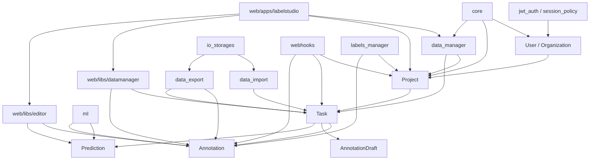
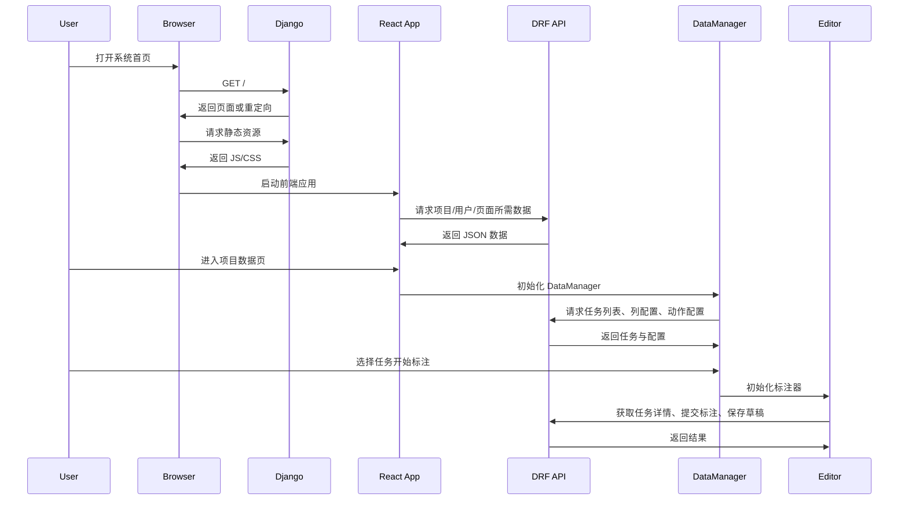

# Label Studio 项目技术栈与业务逻辑分析

## 项目定位

该项目本质上是一个通用的数据标注平台。系统支持多种数据类型的标注，包括文本、图片、音频、视频、时序数据等。它既提供项目管理、任务分发、标注执行、结果导出等基础能力，也提供外部存储接入、机器学习预测、Webhook 等平台化扩展能力。

从仓库结构和模块划分来看，这是一个前后端一体的大型工程，而不是单纯的 Django 后台或单页前端应用。

## 一、技术栈分析

### 1. 后端技术栈

后端基于 Python 和 Django 构建，核心框架如下：

- Python `>=3.10,<4`
- Django `5.1.x`
- Django REST Framework `3.15.x`
- `drf-spectacular` 用于 OpenAPI 文档生成
- `django-rq` + `rq` 用于异步任务
- `djangorestframework-simplejwt` 用于 JWT 认证
- `django-filter` 用于列表过滤
- `rules` 用于对象级权限控制

依赖定义位于：

- [pyproject.toml](/Users/nengli/projects/py_projects/label-studio/pyproject.toml)

#### 数据与基础设施相关组件

- PostgreSQL / SQLite
- Redis / RQ 队列
- S3 / GCS / Azure Blob / LocalFiles / Redis Storage
- `boto3`、`google-cloud-storage`、`azure-storage-blob`

#### 后端架构特点

- 使用 Django app 进行业务拆分
- 使用 DRF 暴露 API
- 使用 `JSONField` 存储任务数据、标注结果、模型预测等动态结构
- 支持组织、项目、任务、标注、导入导出、对象存储、机器学习后端等多个领域模块

### 2. 前端技术栈

前端位于 `web/` 目录，是一个独立的 monorepo，采用 Nx 管理多应用和多库。

核心技术包括：

- React `18.3.1`
- Nx
- React Router v5
- Ant Design
- Radix UI
- Jotai
- MobX / MobX-State-Tree
- TanStack Query
- Cypress / Jest / Storybook

依赖定义位于：

- [web/package.json](/Users/nengli/projects/py_projects/label-studio/web/package.json)

#### 前端结构特点

- `web/apps/labelstudio` 是主应用
- `web/libs/editor` 是标注器相关库
- `web/libs/datamanager` 是数据管理相关库
- 页面采用 React 路由和页面注册机制组织
- 前端不是单一应用，而是“主应用 + 数据管理器 + 标注器”组合架构

### 3. 工程与部署

项目具备完整的容器化和部署支持：

- `Dockerfile`
- `Dockerfile.development`
- `Dockerfile.testing`
- `docker-compose.yml`
- `docker-compose.minio.yml`
- `docker-compose.mysql.yml`

此外还包含：

- `Makefile`
- 文档站 `docs/`
- 测试镜像与部署脚本

这说明项目具备完整的开发、测试、部署和文档体系。

## 二、后端模块结构分析

根据 `label_studio/` 下的 Django apps，可以看出主要业务模块如下：

- `core`: 全局配置、主入口、基础视图、中间件、静态资源
- `users`: 用户体系
- `organizations`: 组织体系
- `projects`: 项目管理
- `tasks`: 任务、标注、草稿、预测
- `data_import`: 数据导入
- `data_export`: 数据导出
- `data_manager`: 数据管理页和任务浏览逻辑
- `io_storages`: 外部存储接入
- `ml`: 机器学习后端接入
- `ml_models` / `ml_model_providers`: 模型运行和模型提供方相关能力
- `webhooks`: Webhook 回调
- `labels_manager`: 标签统计和标签管理
- `jwt_auth`: JWT 认证
- `session_policy`: 会话策略
- `fsm`: 状态机相关能力

核心配置入口位于：

- [label_studio/core/settings/base.py](/Users/nengli/projects/py_projects/label-studio/label_studio/core/settings/base.py)
- [label_studio/core/urls.py](/Users/nengli/projects/py_projects/label-studio/label_studio/core/urls.py)
- [label_studio/manage.py](/Users/nengli/projects/py_projects/label-studio/label_studio/manage.py)

## 三、核心业务模型

系统核心业务关系可以概括为：

`Organization -> Project -> Task -> Annotation / Draft / Prediction`

### 1. User

用户模型定义在：

- [label_studio/users/models.py](/Users/nengli/projects/py_projects/label-studio/label_studio/users/models.py)

特征：

- 使用 email 作为登录标识
- 用户有 `active_organization`
- 支持头像、姓名、快捷键等个性化配置
- 提供 token、最近活跃时间等能力

### 2. Project

项目模型定义在：

- [label_studio/projects/models.py](/Users/nengli/projects/py_projects/label-studio/label_studio/projects/models.py)

项目是整个平台最核心的业务容器，主要负责：

- 绑定组织
- 定义标注配置 `label_config`
- 定义说明文档、跳过策略、协作预测、最大标注数等规则
- 关联任务、标注、预测、导入导出等资源

其中最关键字段是：

- `label_config`: 标注界面配置，使用 XML DSL
- `parsed_label_config`: 解析后的配置
- `show_instruction`
- `show_skip_button`
- `maximum_annotations`

`label_config` 是平台灵活性的核心抽象，它决定了标注器如何渲染以及任务数据如何被解释。

### 3. Task

任务模型定义在：

- [label_studio/tasks/models.py](/Users/nengli/projects/py_projects/label-studio/label_studio/tasks/models.py)

任务表示待标注的数据项，主要字段包括：

- `data`: 任务原始数据，JSON 结构
- `meta`: 附加元信息
- `project`: 所属项目
- `is_labeled`: 是否已完成标注
- `overlap`: 需要多少标注员处理
- `total_annotations`
- `total_predictions`

任务支持锁定、跳过、重入队列、预测预标注等逻辑，是标注工作流中的中心对象。

### 4. Annotation

标注模型定义在：

- [label_studio/tasks/models.py](/Users/nengli/projects/py_projects/label-studio/label_studio/tasks/models.py)

标注是标注员对任务产生的正式结果，主要字段包括：

- `result`: 标注结果 JSON
- `completed_by`: 标注人
- `was_cancelled`: 是否跳过
- `ground_truth`: 是否为真值
- `lead_time`: 标注耗时
- `parent_prediction`: 来源预测
- `parent_annotation`: 来源标注

### 5. AnnotationDraft

草稿用于保存未正式提交的中间结果，支持：

- 暂存标注内容
- 推迟处理
- 草稿转正式标注

### 6. Prediction

预测表示来自机器学习模型或离线导入的预标注结果，主要用于：

- 预标注
- 交互式标注建议
- 模型结果回显

## 四、核心业务逻辑

### 1. 系统主流程

系统核心业务主线可以概括为：

1. 用户登录并进入组织空间
2. 创建项目
3. 配置标注模板 `label_config`
4. 导入任务数据
5. 通过 Data Manager 浏览和筛选任务
6. 标注员对任务执行标注
7. 保存草稿或提交正式标注
8. 可选接入 ML 后端生成预测
9. 导出标注结果用于训练或下游处理

### 2. 首页和路由逻辑

根路径入口位于：

- [label_studio/core/views.py](/Users/nengli/projects/py_projects/label-studio/label_studio/core/views.py)

逻辑大致如下：

- 若用户未登录，则跳转登录页
- 若用户已登录但没有激活组织，则退出并跳转登录
- 若开启 homepage feature flag，进入首页
- 否则默认跳转项目列表页

主 URL 聚合位于：

- [label_studio/core/urls.py](/Users/nengli/projects/py_projects/label-studio/label_studio/core/urls.py)

这里把各个 app 的路由统一挂载到系统根路径下。

### 3. 项目管理逻辑

项目相关接口位于：

- [label_studio/projects/urls.py](/Users/nengli/projects/py_projects/label-studio/label_studio/projects/urls.py)

包含以下关键能力：

- 项目 CRUD
- 项目计数统计
- 获取下一个待标注任务
- 标注配置校验
- 项目摘要统计
- 项目任务列表
- 项目导入记录和重导入记录
- 模型版本查询
- 项目标注人员查询

说明项目模块不仅负责项目本身，还承担项目级工作流入口角色。

### 4. 数据导入逻辑

导入相关接口位于：

- [label_studio/data_import/urls.py](/Users/nengli/projects/py_projects/label-studio/label_studio/data_import/urls.py)

支持：

- 批量导入任务
- 导入预测结果
- 重导入
- 文件上传
- 提供上传文件访问接口

导入后的数据会转化为项目下的 `Task` 记录。

### 5. 数据管理逻辑

数据管理模块路由位于：

- [label_studio/data_manager/urls.py](/Users/nengli/projects/py_projects/label-studio/label_studio/data_manager/urls.py)

它同时包含：

- 后端 API：列、视图、动作、项目状态
- 前端页面路由：`/projects/<id>/data/`

前端数据管理页位于：

- [web/apps/labelstudio/src/pages/DataManager/DataManager.jsx](/Users/nengli/projects/py_projects/label-studio/web/apps/labelstudio/src/pages/DataManager/DataManager.jsx)

这个页面的职责不是单纯渲染 React 组件，而是动态加载并初始化独立的 DataManager 库，然后接管：

- 任务浏览
- 任务筛选
- 导入导出入口
- 设置入口
- 标注工作流切换
- 交互式 ML 建议

这说明 Data Manager 是平台里的一个重要子系统。

### 6. 标注执行逻辑

任务和标注接口位于：

- [label_studio/tasks/urls.py](/Users/nengli/projects/py_projects/label-studio/label_studio/tasks/urls.py)

支持：

- 任务查询
- 任务详情
- 任务下标注列表
- 草稿列表
- 标注详情
- 草稿详情
- 预测接口

标注过程的关键逻辑包括：

- 任务锁定 `TaskLock`
- 跳过逻辑 `was_cancelled`
- 多人重叠标注 `overlap`
- Ground Truth 标注
- 草稿保存
- 标注结果计数更新

### 7. 导出逻辑

导出接口位于：

- [label_studio/data_export/urls.py](/Users/nengli/projects/py_projects/label-studio/label_studio/data_export/urls.py)

支持：

- 导出项目结果
- 获取支持的导出格式
- 查询已生成的导出文件
- 下载导出文件
- 导出结果转换

这部分是平台对外提供数据资产的主要出口。

### 8. 外部存储逻辑

对象存储接口位于：

- [label_studio/io_storages/urls.py](/Users/nengli/projects/py_projects/label-studio/label_studio/io_storages/urls.py)

支持的存储类型包括：

- S3
- Azure Blob
- Google Cloud Storage
- Redis
- Local Files

支持的能力包括：

- 存储源 CRUD
- 存储配置校验
- 文件列举
- 同步
- 导出存储
- 存储 URI 解析 / 预签名访问

这意味着系统不仅支持“把文件传上来”，也支持“从外部存储源直接同步数据进项目”。

### 9. 机器学习集成逻辑

ML 接口位于：

- [label_studio/ml/urls.py](/Users/nengli/projects/py_projects/label-studio/label_studio/ml/urls.py)

支持：

- ML Backend 列表与详情
- 训练触发
- 测试预测
- 交互式标注
- 模型版本管理

在任务模型中，`get_predictions_for_prelabeling()` 会根据项目设置决定是否拉取模型预测。前端的 Data Manager 也会监听标注区域绘制完成事件，并调用交互式 ML 接口获取建议结果。

这部分说明 ML 能力是业务增强模块，不是主数据模型本身，但与标注体验深度耦合。

## 五、前端业务结构分析

### 1. 前端入口

主入口位于：

- [web/apps/labelstudio/src/main.tsx](/Users/nengli/projects/py_projects/label-studio/web/apps/labelstudio/src/main.tsx)

这里会注册分析能力，并加载应用主模块、service worker 和状态注册逻辑。

### 2. 页面组织方式

页面索引位于：

- [web/apps/labelstudio/src/pages/index.js](/Users/nengli/projects/py_projects/label-studio/web/apps/labelstudio/src/pages/index.js)

当前可见的页面集合包括：

- 首页
- 项目列表
- 组织页
- 模型页
- 账户设置页

前端路由动态生成逻辑位于：

- [web/apps/labelstudio/src/providers/RoutesProvider.jsx](/Users/nengli/projects/py_projects/label-studio/web/apps/labelstudio/src/providers/RoutesProvider.jsx)

前端采用“页面组件声明路径和元信息，再统一转成路由表”的方式组织，而不是集中式硬编码路由。

### 3. 前后端协作方式

这个项目不是纯前后端分离模式，而是“Django 提供页面兜底路由 + React 接管页面内容”的混合模式。

根据：

- [web/apps/labelstudio/README.md](/Users/nengli/projects/py_projects/label-studio/web/apps/labelstudio/README.md)

React 页面即使已存在，对应的 Django URL 仍需要存在，否则服务端会先返回 404。

因此系统路由分两层：

- Django 负责服务端路径可访问
- React 负责客户端页面实际渲染

## 六、架构特点总结

### 1. 平台型架构，而非单场景应用

项目并不是只做某一种标注业务，而是通过 `label_config` 抽象支持多种任务类型，适合作为平台底座。

### 2. 核心数据模型稳定，业务扩展围绕核心对象展开

主数据模型较稳定：

- 用户
- 组织
- 项目
- 任务
- 标注
- 预测

其余能力如导入、导出、存储、ML、Webhook 等，都是围绕这些核心对象进行扩展。

### 3. 高度依赖动态结构

大量使用：

- `JSONField`
- XML 配置
- 动态标签和结果结构

这让系统具备很强的灵活性，但也意味着：

- 后端数据约束弱于强类型业务系统
- 前端渲染和解析逻辑复杂
- 配置驱动能力是系统核心竞争力

### 4. 前端是多子系统协作，不是单体页面应用

前端至少可分为几个层次：

- 主应用 `labelstudio`
- 数据管理器 `datamanager`
- 标注器 `editor`

主应用负责页面壳和导航，真正复杂的标注交互和任务浏览则由专门子库承载。

## 七、适合二次开发的切入点

如果要继续深入这个项目，可以优先从以下目录入手：

### 1. 如果关注业务主流程

- [label_studio/projects](/Users/nengli/projects/py_projects/label-studio/label_studio/projects)
- [label_studio/tasks](/Users/nengli/projects/py_projects/label-studio/label_studio/tasks)
- [label_studio/data_manager](/Users/nengli/projects/py_projects/label-studio/label_studio/data_manager)

### 2. 如果关注前端页面和交互

- [web/apps/labelstudio](/Users/nengli/projects/py_projects/label-studio/web/apps/labelstudio)
- [web/libs/editor](/Users/nengli/projects/py_projects/label-studio/web/libs/editor)
- [web/libs/datamanager](/Users/nengli/projects/py_projects/label-studio/web/libs/datamanager)

### 3. 如果关注平台扩展能力

- [label_studio/data_import](/Users/nengli/projects/py_projects/label-studio/label_studio/data_import)
- [label_studio/data_export](/Users/nengli/projects/py_projects/label-studio/label_studio/data_export)
- [label_studio/io_storages](/Users/nengli/projects/py_projects/label-studio/label_studio/io_storages)
- [label_studio/ml](/Users/nengli/projects/py_projects/label-studio/label_studio/ml)
- [label_studio/webhooks](/Users/nengli/projects/py_projects/label-studio/label_studio/webhooks)

## 八、结论

该项目的核心可以概括为一句话：

**这是一个以项目、任务、标注为中心，以配置驱动标注界面，以导入导出、存储和机器学习能力为扩展的通用数据标注平台。**

从工程角度看，它具有以下明显特征：

- 后端采用 Django + DRF 的模块化平台架构
- 前端采用 React + Nx 的多应用多库架构
- 核心业务围绕 `Project / Task / Annotation` 展开
- 系统通过 `label_config` 和 JSON 结构支持多种标注场景
- 导入、导出、对象存储、ML 集成构成平台级扩展能力

如果后续需要继续分析，可以进一步输出：

- 模块依赖关系图
- 请求链路图
- 前后端调用映射
- 关键接口清单
- 二次开发改造建议

## 九、模块关系图

下面的关系图描述了系统主要模块之间的依赖与协作关系：



### 模块关系说明

- `core` 是系统聚合入口，负责 settings、总路由、首页入口和基础中间件。
- `users` 与 `organizations` 提供账户和组织隔离能力。
- `projects` 是业务主容器，向下管理 `tasks`、标注配置、项目统计和项目级规则。
- `tasks` 是任务与标注域的核心，内部聚合 `Task`、`Annotation`、`AnnotationDraft`、`Prediction`、`TaskLock`。
- `data_import` 负责把外部数据转成任务。
- `data_export` 负责把任务和标注结果转成可下载数据。
- `io_storages` 负责把外部存储源接入到导入导出流程。
- `ml` 负责与模型后端交互，为任务提供预测和交互式建议。
- `data_manager` 是任务浏览、筛选、跳转标注的业务中枢。
- 前端主应用 `web/apps/labelstudio` 负责页面壳，`web/libs/datamanager` 和 `web/libs/editor` 分别负责任务管理和标注交互。

## 十、核心接口表

下面按业务场景整理关键接口。这里列的是理解主流程最重要的接口，而不是完整 API 列表。

| 模块 | 接口 | 方法 | 作用 |
| --- | --- | --- | --- |
| Core | `/` | GET | 系统首页入口，按登录态和 feature flag 跳转 |
| Core | `/api/version/` | GET | 查看服务端版本信息 |
| Projects | `/api/projects/` | GET, POST | 查询项目列表、创建项目 |
| Projects | `/api/projects/<pk>/` | GET, PATCH, DELETE | 查看、更新、删除项目 |
| Projects | `/api/projects/<pk>/next/` | GET | 获取项目下一个待标注任务 |
| Projects | `/api/projects/validate/` | POST | 校验标注配置 |
| Projects | `/api/projects/<pk>/summary/` | GET | 查看项目汇总统计 |
| Projects | `/api/projects/<pk>/tasks/` | GET, DELETE | 查询项目任务列表、批量删除任务 |
| Tasks | `/api/tasks/` | GET | 查询任务列表 |
| Tasks | `/api/tasks/<pk>/` | GET, PATCH, DELETE | 查看、更新、删除任务 |
| Tasks | `/api/tasks/<pk>/annotations/` | GET, POST | 查询任务标注、提交标注 |
| Tasks | `/api/tasks/<pk>/drafts` | GET, POST | 查询任务草稿、保存草稿 |
| Tasks | `/api/annotations/<pk>/` | GET, PATCH, DELETE | 查看、更新、删除单条标注 |
| Tasks | `/api/drafts/<pk>/` | GET, PATCH, DELETE | 查看、更新、删除草稿 |
| Tasks | `/api/predictions/` | GET, POST | 查询或创建预测结果 |
| Import | `/api/projects/<pk>/import` | POST | 导入任务数据 |
| Import | `/api/projects/<pk>/tasks/bulk/` | POST | 批量创建任务 |
| Import | `/api/projects/<pk>/import/predictions` | POST | 导入预测结果 |
| Import | `/api/projects/<pk>/reimport` | POST | 重导入任务 |
| Export | `/api/projects/<pk>/export` | GET, POST | 导出结果 |
| Export | `/api/projects/<pk>/export/formats` | GET | 查询支持的导出格式 |
| Export | `/api/projects/<pk>/exports/` | GET, POST | 查看导出记录、创建导出任务 |
| Export | `/api/projects/<pk>/exports/<export_pk>/download` | GET | 下载导出文件 |
| Data Manager | `/api/dm/project/` | GET | 获取数据管理所需项目状态 |
| Data Manager | `/api/dm/columns/` | GET | 获取数据管理列表列定义 |
| Data Manager | `/api/dm/actions/` | GET | 获取批量动作定义 |
| Data Manager | `/api/dm/views/` | GET, POST | 管理筛选视图 |
| Storages | `/api/storages/` | GET | 查询所有导入存储 |
| Storages | `/api/storages/types` | GET | 查询支持的存储类型 |
| Storages | `/api/storages/s3/` | GET, POST | 管理 S3 导入存储 |
| Storages | `/api/storages/export/s3` | GET, POST | 管理 S3 导出存储 |
| Storages | `/tasks/<task_id>/resolve/` | GET | 解析任务中的外部存储 URI |
| ML | `/api/ml/` | GET, POST | 查询或创建 ML Backend |
| ML | `/api/ml/<pk>` | GET, PATCH, DELETE | 查看、更新、删除 ML Backend |
| ML | `/api/ml/<pk>/train` | POST | 触发模型训练 |
| ML | `/api/ml/<pk>/predict/test` | POST | 测试模型预测 |
| ML | `/api/ml/<pk>/interactive-annotating` | POST | 获取交互式标注建议 |

### 接口使用上的几个关键点

- 项目相关接口承担了主流程编排职责，不只是简单 CRUD。
- `next`、`summary`、`validate` 这类接口是业务能力接口，不是资源型接口。
- `data_manager` 的接口主要服务前端任务浏览器，不直接等同于 `tasks` 的基础 CRUD。
- 存储模块接口很多，但本质上都是围绕“定义外部数据源并同步”展开。
- ML 接口既支持离线训练/测试，也支持标注过程中的实时建议。

## 十一、启动流程说明

这一部分从开发视角说明系统是如何启动的，以及前后端如何协同工作。

### 1. 后端启动流程

典型开发启动方式：

```bash
poetry install
python label_studio/manage.py migrate
python label_studio/manage.py collectstatic
python label_studio/manage.py runserver
```

对应入口：

- [label_studio/manage.py](/Users/nengli/projects/py_projects/label-studio/label_studio/manage.py)

启动链路可以概括为：

1. `manage.py` 设置 `DJANGO_SETTINGS_MODULE=core.settings.label_studio`
2. Django 加载 [label_studio/core/settings/label_studio.py](/Users/nengli/projects/py_projects/label-studio/label_studio/core/settings/label_studio.py)
3. 再继承 [label_studio/core/settings/base.py](/Users/nengli/projects/py_projects/label-studio/label_studio/core/settings/base.py) 中的核心配置
4. Django 初始化 `INSTALLED_APPS`
5. 加载中间件、数据库连接、认证、路由
6. 进入 [label_studio/core/urls.py](/Users/nengli/projects/py_projects/label-studio/label_studio/core/urls.py) 聚合所有业务 URL

### 2. 前端开发启动流程

前端说明见：

- [web/apps/labelstudio/README.md](/Users/nengli/projects/py_projects/label-studio/web/apps/labelstudio/README.md)

典型开发命令在 `web/` 目录下运行：

```bash
yarn install
yarn ls:watch
yarn ls:dev
```

核心逻辑如下：

1. Nx 构建 `labelstudio` 主应用
2. 构建或监听 `editor`、`datamanager` 等依赖库
3. 浏览器访问后由 Django 提供基础页面与静态资源路径
4. React 主应用启动后接管客户端页面渲染

### 3. 用户访问时的实际请求链路

用户在浏览器中打开系统后，典型链路如下：



### 4. 页面路由接管逻辑

这个项目采用“Django 路由兜底 + React 页面接管”的混合架构。

以项目数据页为例：

1. Django 需要先声明如 `/projects/<id>/data/` 这样的 URL
2. 服务端返回页面壳和静态资源
3. React 通过 `RoutesProvider` 匹配当前路径
4. 命中 `DataManagerPage`
5. `DataManagerPage` 再异步加载 `@humansignal/datamanager` 和 `@humansignal/editor`

这就是为什么项目即使有 React 页面，也仍然需要在 Django 里注册 URL。

### 5. Data Manager 与 Editor 的初始化流程

以数据标注主链路为例：

1. 用户进入 `/projects/<id>/data/`
2. React 挂载 `DataManagerPage`
3. 页面动态导入 `@humansignal/datamanager` 与 `@humansignal/editor`
4. `DataManager` 请求 `/api/dm/*`、`/api/projects/*`、`/api/tasks/*`
5. 用户选择任务后切入标注模式
6. 编辑器读取项目 `label_config` 和任务 `data`
7. 标注结果提交到 `/api/tasks/<pk>/annotations/`
8. 草稿保存到 `/api/tasks/<pk>/drafts`
9. 如启用交互式 ML，则进一步请求 `/api/ml/<pk>/interactive-annotating`

### 6. 启动和运行中的关键配置点

启动和运行时需要重点关注以下配置：

- `DJANGO_SETTINGS_MODULE`
- `DJANGO_DB`
- `ALLOWED_HOSTS`
- `CORS_ALLOWED_ORIGINS`
- `HOSTNAME`
- `ENABLE_LOCAL_FILES_STORAGE`
- RQ / Redis 相关配置
- 静态资源构建目录

这些配置大多集中在：

- [label_studio/core/settings/base.py](/Users/nengli/projects/py_projects/label-studio/label_studio/core/settings/base.py)
- [label_studio/core/settings/label_studio.py](/Users/nengli/projects/py_projects/label-studio/label_studio/core/settings/label_studio.py)

## 十二、补充结论

如果从“系统如何跑起来”这个角度总结，这个项目的关键机制是：

- Django 提供主入口、认证、API、路由兜底和静态资源分发
- React 主应用负责页面壳和业务页面
- DataManager 负责任务浏览与项目数据操作
- Editor 负责真正的标注交互
- Project、Task、Annotation 三个核心对象贯穿整个业务流程

如果下一步还要继续细化，最值得补充的内容通常有三类：

- 前后端调用映射表
- 关键模型字段说明表
- 本地开发与生产部署差异说明
